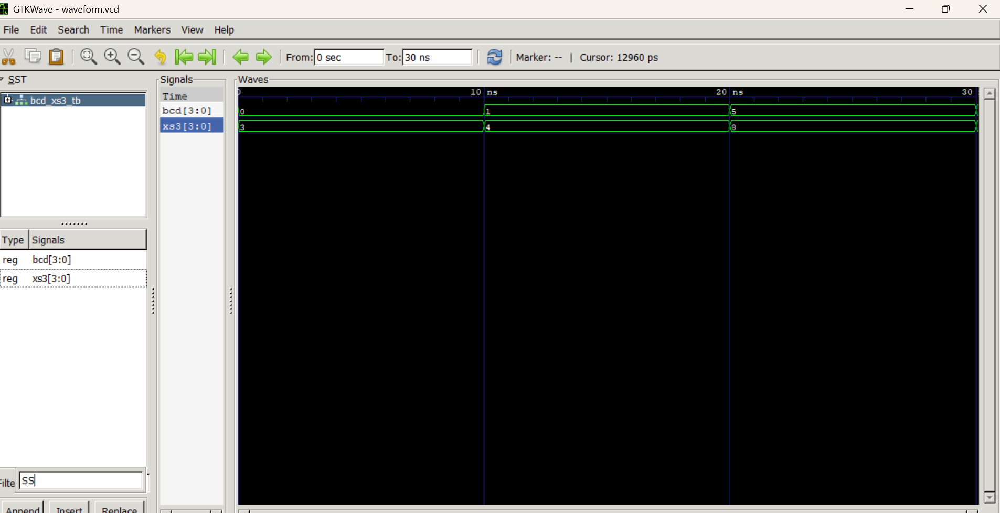
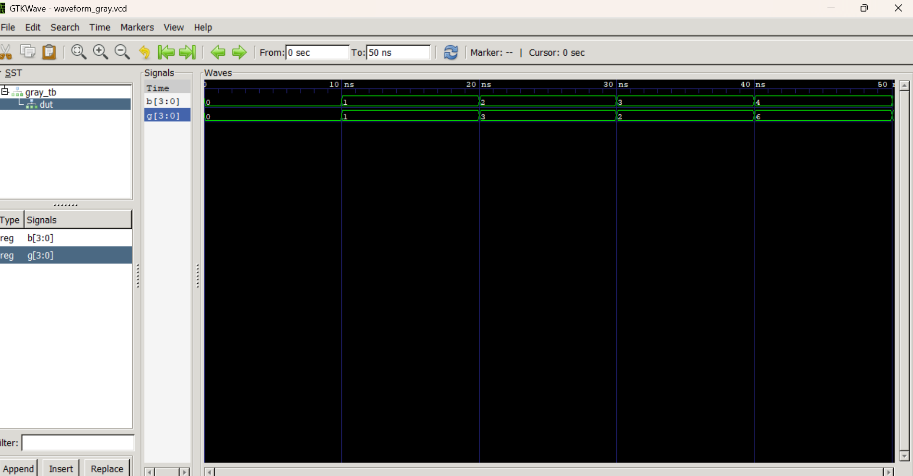

# Lab 6: VHDL Code for Combinational Circuits (Code Converters)

## Objective
To design and simulate a BCD-to-Excess-3 code converter in VHDL.
To design and simulate a Binary-to-Gray code converter in VHDL.

---

## Theory & Reference Tables

### 1. BCD to Excess-3 Converter
Excess-3 (XS-3) is a non-weighted Binary Coded Decimal (BCD) code obtained by adding 3 (`0011`) to each BCD digit. It is a self-complementing code, making it particularly useful in digital arithmetic circuits for subtraction operations.

#### Truth Table
| Decimal | BCD Input (DCBA) | Excess-3 Output (WXYZ) |
|:-------:|:----------------:|:----------------------:|
|    0    |       0000       |          0011          |
|    1    |       0001       |          0100          |
|    2    |       0010       |          0101          |
|    3    |       0011       |          0110          |
|    4    |       0100       |          0111          |
|    5    |       0101       |          1000          |
|    6    |       0110       |          1001          |
|    7    |       0111       |          1010          |
|    8    |       1000       |          1011          |
|    9    |       1001       |          1100          |

---

### 2. Binary to Gray Code Converter
Gray code is an unweighted, cyclic binary numeral system where two successive numeric values differ by only a single bit. This structural characteristic prevents timing race conditions and transient errors, making it widely used in hardware peripherals like rotary encoders and asynchronous FIFO pointer synchronization.

---

## Output

### BCD-to-Excess-3 Simulation Waveform
The simulation waveform below confirms that adding `0011` (3 in decimal) to the 4-bit BCD input vector yields the correct Excess-3 output representation.

### Binary-to-Gray Code Simulation Waveform
The waveform below verifies that successive binary counter increments correspond to only a single bit toggling at a time in the generated Gray code output sequence.

---

## Discussion
During this laboratory session, structural/behavioral modeling architectures in VHDL were implemented to realize two critical code conversion systems. 

1. **BCD-to-Excess-3 Converter:** The implementation was verified across valid decimal digits ($0$ through $9$). A key design aspect considered during simulation was handling invalid BCD states ($1010$ to $1111$, or $10$ to $15$ in decimal). In standard physical synthesis, these map to "don't care" conditions, but in the VHDL behavioral code, they were explicitly handled to prevent the unintended generation of hardware latches.
2. **Binary-to-Gray Converter:** The output characteristics verified the core single-bit change behavior of Gray code. For instance, when transitioning from binary `0011` (decimal 3) to `0100` (decimal 4), a standard binary system risks race conditions as three distinct bits change simultaneously. The simulated Gray code output safely transitions from `0010` to `0110`, modifying only a single bit (the MSB), thereby demonstrating its mitigation of transient switching glitches.

The simulation waveforms generated via GHDL and visualized using GTKWave perfectly align with the expected theoretical truth tables for both combinational logic blocks.

---

## Conclusion
The design, implementation, and functional verification of both the BCD-to-Excess-3 and Binary-to-Gray code converters were successfully completed using VHDL. Through this laboratory exercise, practical proficiency was gained in mapping truth tables and boolean equations directly into hardware description language structures. The simulation waveforms conclusively validate that both combinational logic blocks operate correctly according to theoretical specifications, illustrating how distinct binary representations solve specific functional problems in digital architectures.