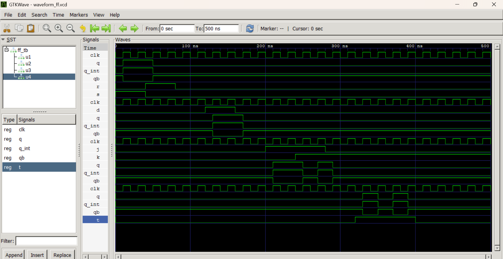

# Lab 7: VHDL Code for Sequential Circuits (Flip-Flops)

## Objective
* To design and simulate SR, D, JK, and T flip-flops in VHDL.
* To understand the role of the clock signal in sequential circuits.

---

## Theory & Reference Tables

Unlike combinational circuits where outputs depend solely on current inputs, **sequential circuits** rely on both current inputs and the previous state. A **Flip-Flop** is a bistable sequential element that stores exactly one bit of data. These memory elements are synchronous, meaning they update their state only when triggered by a transition edge (rising or falling) of a master clock signal (`CLK`).

### 1. SR Flip-Flop (Set-Reset)
The SR flip-flop is the foundational memory element controlled by two inputs: Set ($S$) and Reset ($R$). 
* *Forbidden State:* When both inputs are high ($S=1, R=1$), the circuit enters an invalid, unpredictable state.

| S | R | $Q_{next}$ | State Name | Description |
|:-:|:-:|:----------:|:----------:|:------------|
| 0 | 0 |    $Q$     |  **HOLD** | Retains previous state (No change). |
| 0 | 1 |     0      | **RESET** | Forces output to low. |
| 1 | 0 |     1      |  **SET** | Forces output to high. |
| 1 | 1 |     X      | **INVALID**| Forbidden configuration. |

### 2. D Flip-Flop (Data / Delay)
The D flip-flop captures the exact logic value sitting at the input pin $D$ at the moment of the clock edge and passes it directly to the output.
* **Characteristic Equation:** $Q_{next} = D$

| D | $Q_{next}$ | State Name | Description |
|:-:|:----------:|:----------:|:------------|
| 0 |     0      |  **RESET** | Output becomes 0 on the clock edge. |
| 1 |     1      |   **SET** | Output becomes 1 on the clock edge. |

### 3. JK Flip-Flop
The JK flip-flop eliminates the invalid forbidden state found in the SR design. When both inputs are active ($J=1, K=1$), the circuit gracefully inverts (toggles) its state.
* **Characteristic Equation:** $Q_{next} = J\overline{Q} + \overline{K}Q$

| J | K | $Q_{next}$ | State Name | Description |
|:-:|:-:|:----------:|:----------:|:------------|
| 0 | 0 |    $Q$     |  **HOLD** | Retains previous state (No change). |
| 0 | 1 |     0      | **RESET** | Forces output to low. |
| 1 | 0 |     1      |  **SET** | Forces output to high. |
| 1 | 1 | $\overline{Q}$ | **TOGGLE**| Flips the output to its opposite state. |

### 4. T Flip-Flop (Toggle)
The T flip-flop behaves like a standard digital light switch. It holds its state when low ($T=0$) and alternates its state when high ($T=1$).
* **Characteristic Equation:** $Q_{next} = T \oplus Q$

| T | $Q_{next}$ | State Name | Description |
|:-:|:----------:|:----------:|:------------|
| 0 |    $Q$     |  **HOLD** | Retains previous state (No change). |
| 1 | $\overline{Q}$ | **TOGGLE**| Flips the output to its opposite state. |

---

## Simulation Output

The design entities were compiled and verified using GHDL, with simulation waveforms visualized through GTKWave. Below is the captured behavioral graph showing correct synchronization of inputs relative to the rising clock edge up to `500 ns`.

---

## Discussion

During this laboratory exercise, the structural differences and behavioral mechanics of sequential elements were explored using behavioral VHDL structures. The simulation clearly highlights the strict constraint of synchronous systems: **inputs only affect the system state at the precise moment of a clock signal's rising edge (`rising_edge(CLK)`).** Any transitions occurring between clock edges are safely ignored, shielding the internal memory from logic glitches.

Through the simulation plots, specific edge behaviors were validated:
1. **The SR Latch/FF Limitations:** The input state $S='1', R='1'$ was purposely omitted from our design architecture to prevent unstable, hardware-damaging race conditions.
2. **The Versatility of JK:** When $J$ and $K$ were held high simultaneously, the system inverted state perfectly at each clock tick without locking up.
3. **Internal Feedback Constraints:** Because standard output ports (`out`) cannot be directly read within an active process statement in VHDL, intermediate registry tracking signals (`Q_int`) were declared. These internal tracks handle the mathematical manipulations (such as `not Q_int` for toggles) before routing to the top-level external interface pins.

---

## Conclusion

The objective of designing and verifying SR, D, JK, and T flip-flops using behavioral models in VHDL was successfully completed. The performance of these memory units was comprehensively evaluated via testbench routines up to 500 ns using GHDL and GTKWave. This lab reinforced the foundational significance of clock signals in pacing sequential data movement, providing the critical building blocks necessary for designing larger synchronous state architectures such as hardware registers, digital counters, and complex control units.