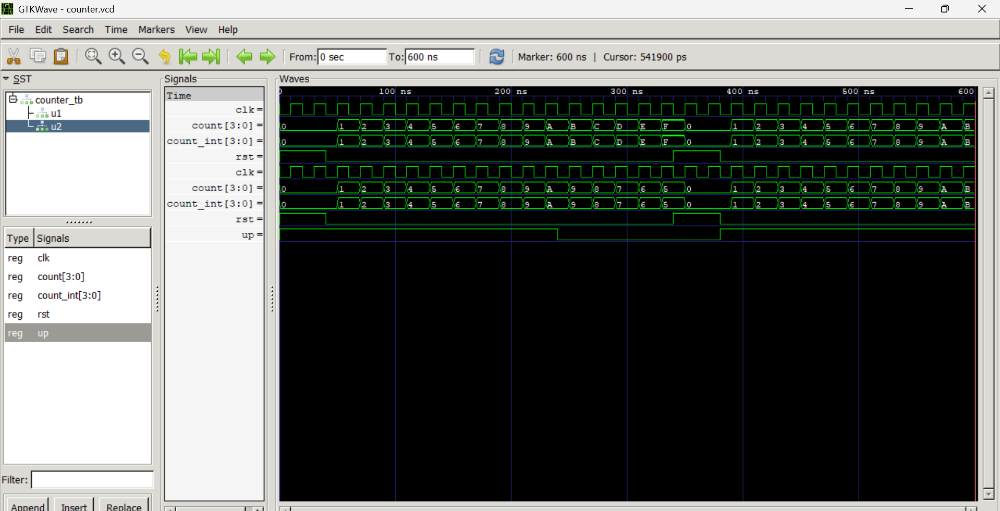

# Lab 8: VHDL Code for Sequential Circuits – Counters

## Objective

- To design and simulate a 4-bit synchronous up counter in VHDL.
- To design and simulate a 4-bit synchronous up/down counter in VHDL.

---

## Theory

A **counter** is a sequential circuit that cycles through a predefined sequence of states on each clock edge. Counters are built from flip-flops and are widely used in timing, sequencing, event counting, and frequency division applications.

### Synchronous Counter

In a synchronous counter, all flip-flops receive the clock signal simultaneously. This makes synchronous counters faster and more reliable than asynchronous (ripple) counters because state transitions occur at the same time.

### Up Counter

An up counter increments its count value by one for every rising edge of the clock signal.

Example:

0000 → 0001 → 0010 → 0011 → ...

## Output

The simulation was performed using GHDL and the generated waveform was viewed using GTKWave.

### Simulation Waveform

### Observations

- Both counters are initially reset to `0000` when `RST = '1'`.
- The 4-bit Up Counter increments by one on every rising edge of the clock.
- The 4-bit Up/Down Counter increments while `UP = '1'`.
- When the `UP` control signal changes to `0`, the Up/Down Counter begins decrementing.
- During the second reset period, both counters return to `0000`.
- After reset is released, counting resumes from zero.
- The counters correctly wrap around after reaching their maximum 4-bit value (`1111` or `F` in hexadecimal).

---

## Discussion

The objective of this experiment was to understand the operation of synchronous counters through VHDL modeling and simulation.

The 4-bit synchronous Up Counter successfully counted from `0000` to `1111` by incrementing its value on each rising edge of the clock signal. The reset signal was implemented as an active-high synchronous reset, meaning the counter state changed only at the next rising clock edge when reset was asserted.

The 4-bit Up/Down Counter demonstrated both incrementing and decrementing operations. While the `UP` signal remained high, the counter behaved as a normal up counter. When the `UP` signal became low, the counting direction changed and the counter decremented on subsequent clock edges. This verified the correct implementation of the direction-control logic.

The waveform obtained from GTKWave matched the expected behavior of both counters. The reset operation, counting sequence, count wrap-around, and direction control were all observed and verified successfully.

---

## Conclusion

In this laboratory experiment, a 4-bit synchronous Up Counter and a 4-bit synchronous Up/Down Counter were designed and simulated using VHDL.

The simulation results confirmed that:

- The Up Counter increments correctly on each rising edge of the clock.
- The Up/Down Counter increments and decrements according to the value of the `UP` control signal.
- The synchronous reset correctly initializes the counters to zero.
- The observed waveforms matched the theoretical behavior of synchronous counters.

Therefore, the objectives of the experiment were successfully achieved, and the operation of synchronous sequential circuits and counters was clearly demonstrated.