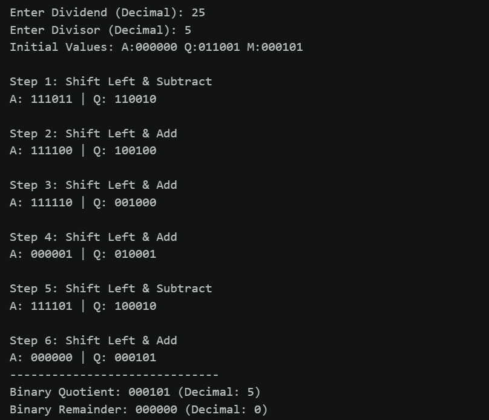

# Lab 9: Implementation of Booth's Multiplication Algorithm

## Objective
* To understand the working mechanism of Booth's multiplication algorithm for signed binary numbers in two's complement representation.
* To implement the algorithm programmatically and verify its correctness across various test cases (positive and negative inputs).

---

## Theory
Developed by Andrew Donald Booth in 1951, **Booth's Algorithm** is an efficient multiplication method for signed binary numbers represented in two's complement form. 

Unlike traditional multiplication—which adds the multiplicand whenever a bit in the multiplier is `1`—Booth's algorithm examines pairs of adjacent bits in the multiplier. By recognizing long sequences ("runs") of consecutive `1`s, it replaces multiple addition steps with a single subtraction at the start of the sequence and an addition at the end. This reduces the total number of arithmetic operations required during multiplication.

---

## Algorithm Steps
Given an $n$-bit multiplicand ($M$) and an $n$-bit multiplier ($Q$):

1. **Initialization:**
   * Accumulator ($A$) = $0$ (padded to $n$ bits)
   * Extra bit ($Q_{-1}$) = $0$
   * Step Count ($N$) = $n$ (bit length of the inputs)

2. **Bit Inspection & Operation:**
   Inspect the combined least significant bit of $Q$ ($Q_0$) and $Q_{-1}$:

   | $Q_0$ | $Q_{-1}$ | Operation |
   | :---: | :---: | :--- |
   | **0** | **0** | No operation (shift only) |
   | **0** | **1** | $A = A + M$ |
   | **1** | **0** | $A = A - M$ |
   | **1** | **1** | No operation (shift only) |

3. **Arithmetic Right Shift:**
   Perform an arithmetic right shift (ARS) on the combined register state $[A, Q, Q_{-1}]$ by $1$ bit. Preserve the sign bit (most significant bit of $A$).

4. **Loop:**
   Decrement the step count $N$. Repeat steps 2–3 until $N = 0$.

5. **Final Result:**
   The final $2n$-bit product is stored in the combined registers $[A, Q]$.

---

## Example Trace
For $n = 8$ bits, multiplying $M = 7$ (`00000111`) by $Q = -3$ (`11111101`):

* **Initial State:** $A = 00000000$, $Q = 11111101$, $Q_{-1} = 0$, Count = 8
* **Step 1:** $Q_0 Q_{-1} = 10 \rightarrow A = A - M \rightarrow$ Shift Right
* **Steps 2–8:** Perform corresponding addition/subtraction and arithmetic shift operations based on $Q_0 Q_{-1}$ transitions.
* **Result:** $A, Q$ contains `1111111111101011` (Decimal: $-21$).

---

## Output

## Discussion
1. **Efficiency Over Standard Multiplication:**
   In standard binary multiplication, each `1` bit forces an addition of the shifted multiplicand. In the worst-case scenario for Booth's algorithm (alternating `1`s and `0`s, such as `10101010`), the number of additions/subtractions equals $n$. However, for typical workloads containing clusters of `1`s (e.g., `00111100`), Booth's algorithm reduces the number of operations to just two (one subtraction at the start of the block and one addition at the end).

2. **Handling Signed Numbers:**
   One of the key strengths of Booth's algorithm is its seamless handling of negative numbers without needing special hardware or separate sign-magnitude calculations. Because two's complement sign-extension is preserved during the arithmetic right shift, both positive and negative multipliers/multiplicands yield accurate results automatically.

3. **Implementation Details:**
   In our implementation, two's complement conversions are used for subtraction steps ($A = A + \sim M + 1$). The logical bit manipulation simulates how hardware registers interact during a CPU clock cycle.

---

## Conclusion
* Booth's multiplication algorithm was successfully implemented and verified against standard signed decimal arithmetic test cases.
* The algorithm demonstrated its efficiency in handling signed multiplication directly in two's complement notation without requiring separate processing for sign bits.
* Understanding this algorithm provides foundational insights into ALU (Arithmetic Logic Unit) design, low-level binary arithmetic execution, and computer architecture optimization strategies.